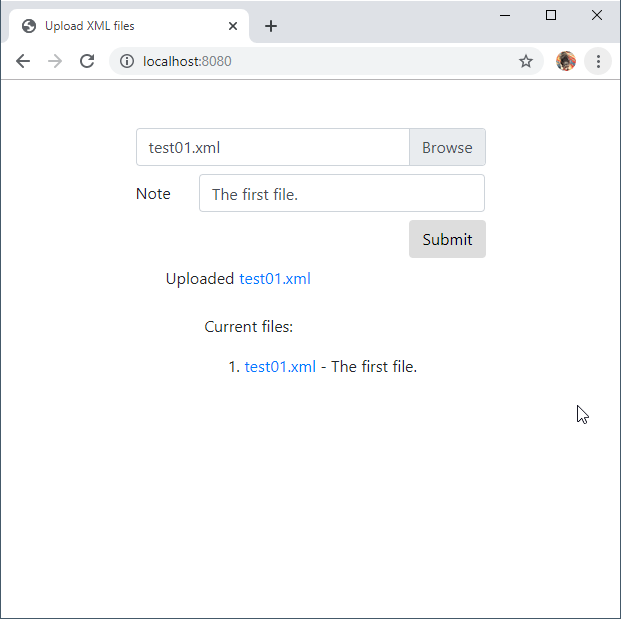
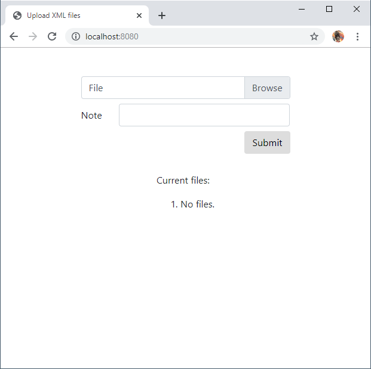
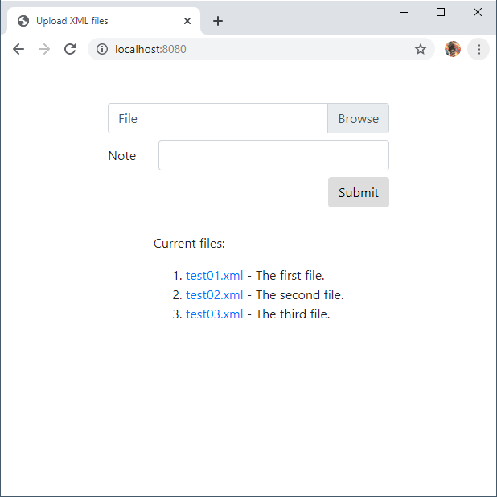
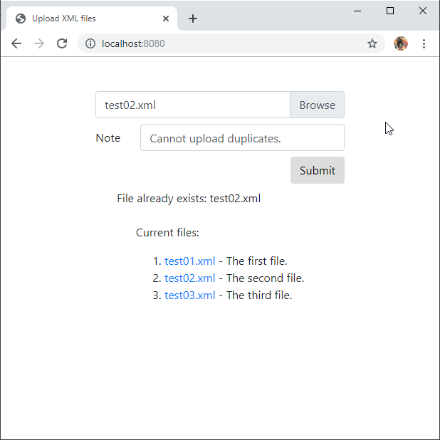
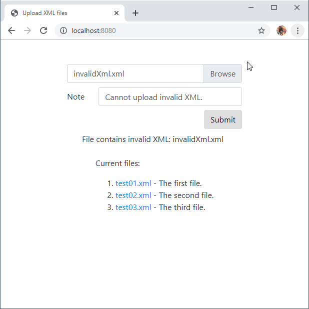
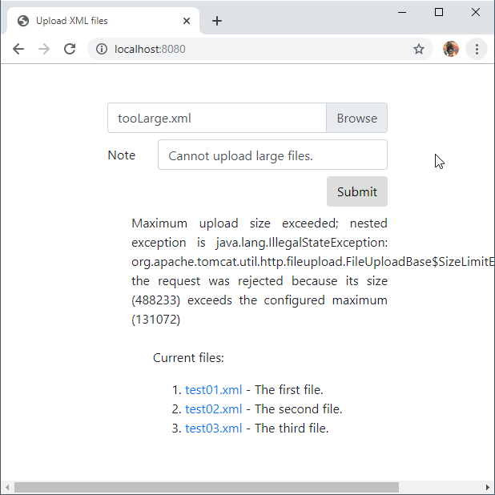
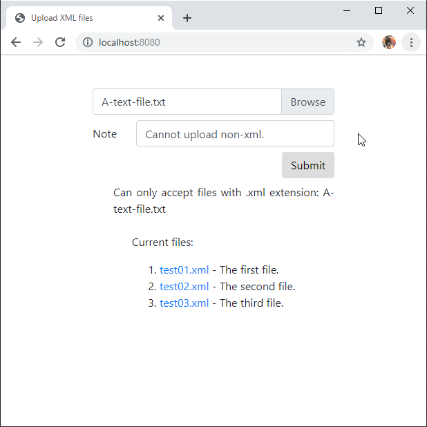

# Coding exercise

A single page application that talks to a RESTful end point to upload XML and store to a database, with another RESTful interface to download the XML document.

Files can be downloaded by clicking on the links in the app, as per the screenshots below.

Screenshots.

After uploading a document successfully.



After uploading one file.


When there are no files.



Listing current files.



When you try to upload a file that already exists. Only checks file name. No update procedure has been created.



When you try to upload an invalid XML file.



When you try to upload a large file.



When you try to upload a non-xml file (no `.xml` extension).




# How to build and run the app

## Pre-requisites

- MySQL version 8 or better. 
- JDK 11 or later
- Maven 3.6+

## Download source

Get the source from `github`.

```
cd /path/to/projects
git clone git@github.com:robertmarkbram/ce-upload-xml.git
cd ce-upload-xml
```

## Create database for use by the application

Command line instructions to create MySQL database that the application will use.

```bash
mysql --host=127.0.0.1 --port=3306 --user=root --password # then enter password 
```

Within the MySQL session, create the database with the following:

```sql
create database xml_doc_library; -- Creates the new database
create user 'xml_doc_user'@'%' identified by 'Se$curePas@@word'; -- Creates the user
grant all on xml_doc_library.* to 'xml_doc_user'@'%'; -- Gives all privileges to the new user on the newly created database
```

## Run instructions

```bash
mvn clean package
mvn spring-boot:run
```

Open http://localhost:8080/

# Future considerations

- XML documents can be validated against set XSDs.
- Separate indexing mechanisms can be applied to files.
- Allow an update operation.
- Add better validation mechanisms using validation framwork.

# Requirements

Create a single page front end with a form that lets a user upload an XML file to a database.

Data will be accepted from the front end via a RESTful end point. There should also be a RESTful end point that lets users download the file.

## Application

Use the following:

- HTML front end
  - Stretch goal: React or Angular
- Java 
- Maven build-system. based 
- SpringBoot 
- RESTful end points.
- MySQL

## Input

A single page with:

- a file input control to load an xml file.
  - Keep the original file name if possible.
- A text field - some description or note about the XML file.
- a submit button.

Validate that the file is a well formed XML document before storing it. Return an error and notify the user if the document is not valid.

## Output

Create a REST endpoint to allow users to download the XML document stored in the DB.

Request for this call should have one parameter - original file name. 

No user interface is required for this API call. 

## Tests

Write unit/integration tests for the backend.

# TODO

- [X] Start with https://spring.io/guides/gs/accessing-data-mysql/ and build up the project from https://start.spring.io/. [2019-11-30]
- [X] Create git repo with initial commit and push. [2019-11-30]
- [X] Create the empty database and configuration. [2019-11-30]
- [X] Create unit tests against entity model. [2019-11-30]
- [X] Create the entity model. [2019-11-30]
- [X] Create the repository. [2019-11-30]
- [X] Set up in-memory DB for tests. [2019-11-30]
- [X] Create the controller skeleton with input and output end points. [2019-12-01]
  - See: [Spring file uploader](https://spring.io/guides/gs/uploading-files/).
  - See: [Download image or file](https://www.baeldung.com/spring-controller-return-image-file).
- [X] Create RESTful integration tests against the controller input function. [2019-12-01]
- [X] Create XML validator skeleton, unit tests, then implementation. [2019-12-01]
  - See [creating custom validator](https://www.baeldung.com/spring-mvc-custom-validator).
  - See [XML validation](https://simonharrer.wordpress.com/2012/11/05/xml-validation-with-the-java-api/): well formed only, no XSD validation.
- [X] Add validation to controller https://www.baeldung.com/spring-boot-bean-validation. [2019-12-01]
  - [X] Mandatory inputs. [2019-12-01]
  - [X] Max size of inputs. [2019-12-01]
  - [X] XML validation: well formed only, no XSD validation (https://simonharrer.wordpress.com/2012/11/05/xml-validation-with-the-java-api/). [2019-12-01]
- [X] Create RESTful integration tests against the controller output function. [2019-12-01]
  - See: [Learn How to Use JUnit 5 to Test Your Spring Boot Apps](https://dzone.com/articles/learn-how-to-use-junit-5-to-test-your-spring-boot)
- [X] Create the application class. [2019-12-01]
- [X] Create front end page. [2019-12-01]
- [X] Run it. [2019-12-01]
- [ ] Update security.
- [ ] Run it again.